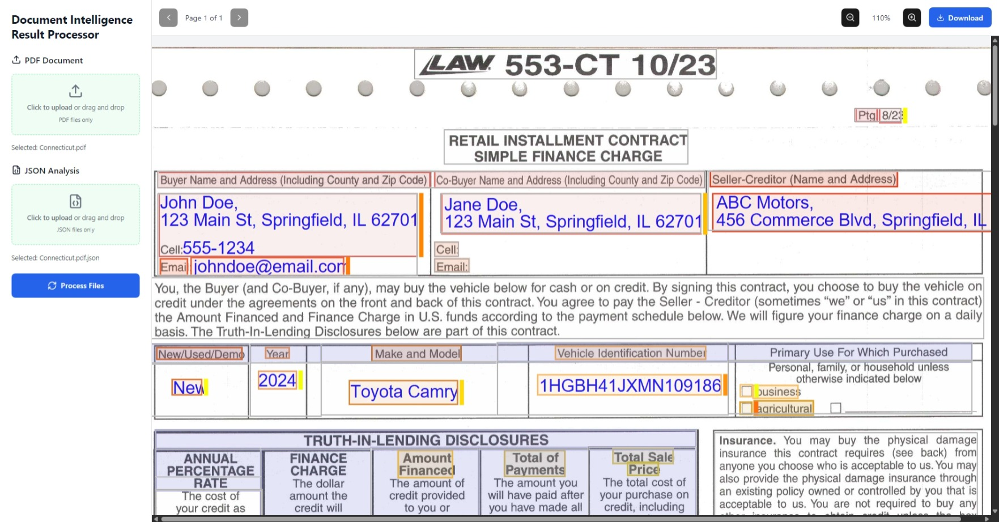

Sure! Here is the updated **README.md** file with instructions on running the Python script directly using the added files `markup_pdf.py` and `requirements.txt`.

---

# Azure Document Intelligence Result Processor

## Overview

This project is a web application that processes PDF documents by overlaying annotations based on analysis results from Azure Document Intelligence. Specifically, it utilizes the **General Document Layout** and **Key Value Pairs** features to extract information from documents and visually represent that data on the original PDF.

Users can upload a PDF document and a corresponding JSON file containing the analysis results. The application processes these files and returns a new PDF with annotations highlighting the extracted data. **Confidence scores for each extracted element are visually represented as color-coded bars next to the annotations, providing a quick visual indication of the recognition confidence.**

 <!-- Replace with the path to your screenshot image -->

*Note: Actual screenshot image of the application is given for the users to gain a visual understanding of the app's interface.*

## Table of Contents

- [Azure Document Intelligence Result Processor](#azure-document-intelligence-result-processor)
  - [Overview](#overview)
  - [Table of Contents](#table-of-contents)
  - [Features](#features)
  - [Prerequisites](#prerequisites)
  - [Setup Instructions](#setup-instructions)
    - [1. Clone the Repository](#1-clone-the-repository)
    - [2. Install Frontend Dependencies](#2-install-frontend-dependencies)
    - [3. Install Backend Dependencies](#3-install-backend-dependencies)
  - [Running the Application](#running-the-application)
    - [1. Start the Backend (Azure Functions)](#1-start-the-backend-azure-functions)
    - [2. Start the Frontend (React Application)](#2-start-the-frontend-react-application)
  - [Running the Python Script Directly](#running-the-python-script-directly)
    - [1. Install Python Dependencies](#1-install-python-dependencies)
    - [2. Run the Script](#2-run-the-script)
  - [Usage](#usage)
    - [Uploading Files](#uploading-files)
    - [Processing and Viewing Results](#processing-and-viewing-results)
  - [Application Structure](#application-structure)
    - [Frontend (`App.tsx`)](#frontend-apptsx)
    - [Backend (`function_app.py`)](#backend-function_apppy)
    - [Python Script (`markup_pdf.py`)](#python-script-markup_pdfpy)
  - [Configuration Details](#configuration-details)
    - [Vite Proxy Configuration](#vite-proxy-configuration)
    - [Alias Configuration](#alias-configuration)
  - [Troubleshooting](#troubleshooting)
  - [Helpful Resources](#helpful-resources)
  - [Contact Information](#contact-information)

## Features

- **PDF Upload**: Upload any PDF document for processing.
- **JSON Upload**: Upload the analysis result JSON file from Azure Document Intelligence.
- **Visual Annotations**: The processed PDF displays key-value pairs, tables, and paragraphs annotated directly on the document.
- **Confidence Indicators**: For each key-value pair, the backend draws a color-coded bar next to the annotation on the PDF to represent its confidence score, offering visual feedback on the accuracy of the recognition.
- **PDF Viewer**: View the original and processed PDFs directly within the application.
- **Download Processed PDF**: Download the annotated PDF for offline viewing or sharing.

## Prerequisites

- **Node.js and npm**: [Download and install Node.js](https://nodejs.org/en/download/), which includes npm.
- **Azure Functions Core Tools**: [Install Azure Functions Core Tools](https://docs.microsoft.com/azure/azure-functions/functions-run-local#install-the-azure-functions-core-tools) to run Azure Functions locally.
- **Python 3.8+**: The backend and the standalone script are written in Python, so you'll need Python installed. [Download Python](https://www.python.org/downloads/).
- **pip**: Ensure that pip is installed for managing Python packages.

## Setup Instructions

### 1. Clone the Repository

```bash
git clone https://github.com/setuc/pdf-annotation-with-azure-doc-intel.git
```

### 2. Install Frontend Dependencies

Navigate to the root directory of the project:

```bash
cd pdf-annotation-with-azure-doc-intel
```

Install the frontend dependencies:

```bash
npm install
```

### 3. Install Backend Dependencies

Navigate to the `api` directory, where the Azure Functions code resides:

```bash
cd api
```

Create a virtual environment and activate it:

```bash
python -m venv .venv
# On Windows:
.\.venv\Scripts\activate
# On macOS/Linux:
source .venv/bin/activate
```

Install the backend dependencies:

```bash
pip install -r requirements.txt
```

## Running the Application

### 1. Start the Backend (Azure Functions)

In the `api` directory, start the Azure Functions host:

```bash
func host start
```

This command runs your backend functions locally at `http://localhost:7071`.

### 2. Start the Frontend (React Application)

Open a new terminal window, navigate to the root directory of the project (if not already there), and start the frontend development server:

```bash
cd ..
npm run dev
```

This command starts the Vite development server. The application should be accessible at `http://localhost:3000`.

**Note**: Ensure both the frontend and backend servers are running simultaneously for the application to function properly.

## Running the Python Script Directly

If you prefer to run the PDF annotation process without the web application, you can use the provided Python script `markup_pdf.py`. This script allows you to process PDFs directly from the command line using a JSON file containing the Azure Document Intelligence analysis results.

### 1. Install Python Dependencies

Navigate to the `python` directory where the script and requirements are located:

```bash
cd python
```

Create a virtual environment and activate it:

```bash
python -m venv .venv
# On Windows:
.\.venv\Scripts\activate
# On macOS/Linux:
source .venv/bin/activate
```

Install the required packages from `requirements.txt`:

```bash
pip install -r requirements.txt
```

### 2. Run the Script

You can run the `markup_pdf.py` script by providing the input PDF file, the JSON file containing the analysis results, and the desired output PDF file path.

```bash
python markup_pdf.py input.pdf analysis_results.json output.pdf
```

Replace `input.pdf` with the path to your original PDF document, `analysis_results.json` with the path to your JSON analysis file, and `output.pdf` with the desired path for the processed PDF.

**Example:**

```bash
python markup_pdf.py ../examples/sample_document.pdf ../examples/analysis_results.json processed_document.pdf
```

**Note:** Ensure that the input files exist and the output path is writable.

The script will process the PDF document, annotate it with the extracted data from the JSON file, and save the annotated PDF at the specified output path.

## Usage

### Uploading Files

- **PDF Document**: Click on the PDF upload area or drag and drop a PDF file. There is a sample PDF and its corresponding JSON file in the `examples` directory of the project.
- **JSON Analysis**: Click on the JSON upload area or drag and drop a JSON file containing the analysis result from Azure Document Intelligence.

### Processing and Viewing Results

- After uploading both files, click on the **Process Files** button.
- The application will process the PDF using the analysis data and display the annotated PDF.
- Use the navigation controls to zoom in/out and navigate between pages.
- Click **Download** to save the processed PDF to your local machine.

## Application Structure

### Frontend (`App.tsx`)

Located at `src/App.tsx`, this file contains the React code for the application's user interface and functionality.

Key Components and Functions:

- **State Management**: Manages states for the uploaded files, processing status, and PDF viewing parameters.
- **File Upload Handlers**: Functions to handle file uploads for both PDF and JSON files.
- **Process Files Function**: Sends the uploaded files to the backend API for processing.

  ```tsx
  const processFiles = React.useCallback(async () => {
    // ... Handles sending files to the backend and updating the state based on the response.
  }, [pdfState.file, jsonState.file]);
  ```

- **React PDF Viewer**: Displays the processed PDF using the `react-pdf` library.

  ```tsx
  <ReactPDF.Document
    file={processedPdf || pdfState.preview}
    // ...
  >
    <ReactPDF.Page
      pageNumber={currentPage}
      // ...
    />
  </ReactPDF.Document>
  ```

- **UI Components**: Includes file upload areas, process button, navigation controls, and viewer.

### Backend (`function_app.py`)

Located at `api/function_app.py`, this file contains the Azure Function that processes the PDF and JSON files.

Key Functions:

- **`process_form` Function**: The main entry point for the Azure Function, handling HTTP requests to the `/api/parse_form` endpoint.

  ```python
  @app.route(route="parse_form", methods=["POST"], auth_level=func.AuthLevel.FUNCTION)
  def process_form(req: func.HttpRequest) -> func.HttpResponse:
      # ... Handles incoming requests, calls process_pdf, and returns the response.
  ```

- **`process_pdf` Function**: Processes the PDF by annotating it based on the JSON data.

  ```python
  def process_pdf(pdf_data: bytes, json_data: dict) -> bytes:
      # ... Loads the PDF, adds annotations, and returns the modified PDF.
  ```

- **Utility Functions**:
  - `generate_distinct_colors`: Generates colors for annotations.
  - `draw_confidence_indicator`: Draws a confidence indicator bar on the PDF.

Processing Steps:

1. **Load PDF**: Opens the PDF file using `PyMuPDF` (fitz).
2. **Parse JSON**: Extracts key-value pairs, tables, and paragraphs from the analysis result.
3. **Annotate PDF**:
   - Draws rectangles around keys and values with varying opacity and colors.
   - Draws confidence indicators based on the confidence scores.
   - Processes tables and paragraphs similarly.
4. **Return Modified PDF**: Saves the annotated PDF to a bytes stream and returns it encoded in base64.

### Python Script (`markup_pdf.py`)

Located at `python/markup_pdf.py`, this standalone Python script allows you to process PDF documents directly, without running the web application or Azure Functions.

Key Features:

- **Command-Line Interface**: Accepts command-line arguments for input PDF, input JSON, and output PDF paths.
- **Logging**: Uses `coloredlogs` for enhanced logging output, providing detailed information during processing.
- **Processing Logic**: Processes the PDF by annotating it based on the JSON data, similar to the backend function.

Usage:

```bash
python markup_pdf.py input.pdf analysis_results.json output.pdf
```

Ensure that `requirements.txt` in the same directory is used to install the required packages (`PyMuPDF` and `coloredlogs`).

## Configuration Details

### Vite Proxy Configuration

Ensures that API calls from the frontend are proxied to the backend Azure Functions:

```typescript
// vite.config.ts
export default defineConfig({
  // ...
  server: {
    proxy: {
      '/api': {
        target: 'http://localhost:7071', // Backend server URL
        changeOrigin: true,
        secure: false,
      },
    },
  },
});
```

### Alias Configuration

Simplifies imports by setting up an alias for the `src` directory:

```typescript
resolve: {
  alias: {
    '@': path.resolve(__dirname, './src'),
  },
},
```

## Troubleshooting

- **Missing Dependencies**: Ensure all dependencies are installed in both frontend (`npm install`) and backend (`pip install -r requirements.txt`).
- **Azure Functions Core Tools**: If the `func` command is not recognized, verify that Azure Functions Core Tools are installed and configured correctly.
- **Port Conflicts**: Make sure ports `7071` (backend) and `3000` (frontend) are available. If not, update the configurations accordingly.
- **CORS Issues**: The backend sets `Access-Control-Allow-Origin` to `*` to allow cross-origin requests. Ensure this is configured properly if modifying the backend.
- **PDF Rendering Issues**: If PDFs are not displaying, verify that the `pdfjs` worker is configured correctly in `App.tsx`.
- **Script Errors**: When running `markup_pdf.py`, ensure that the input files exist and are accessible, and that all required Python packages are installed.

## Helpful Resources

- **Azure Document Intelligence**:
  - [Azure Form Recognizer Documentation](https://docs.microsoft.com/azure/applied-ai-services/form-recognizer/)
- **Frontend Libraries**:
  - [React PDF](https://github.com/wojtekmaj/react-pdf)
  - [React](https://reactjs.org/docs/getting-started.html)
- **Backend Libraries**:
  - [PyMuPDF (fitz)](https://pymupdf.readthedocs.io/en/latest/)
- **Azure Functions**:
  - [Develop Azure Functions using Visual Studio Code](https://docs.microsoft.com/azure/azure-functions/functions-develop-vs-code?tabs=csharp)
- **Python Logging**:
  - [Colored Logs Documentation](https://coloredlogs.readthedocs.io/en/latest/)

## Contact Information

For any questions or assistance, please open an issue:

- **GitHub Issues**: [Link to the repository's issues page]

---

By following these instructions, you should be able to run the Document Intelligence Result Processor application locally, either through the web application or directly via the Python script. Enjoy enhancing your document processing workflows!

---

**Files Added:**

- `markup_pdf.py`: The Python script for annotating PDFs directly from the command line.
- `requirements.txt`: The Python dependencies required to run `markup_pdf.py`.

**Note:** The new `python` directory contains the added files and is structured to keep the standalone script and its dependencies organized separately from the web application's backend.
